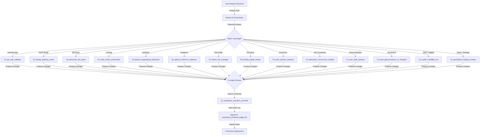

# StockAI Pro: Master AI Orchestrator

## Overview & System Governance
The **Master AI Orchestrator** is the central governance, decision, and routing layer of the StockAI Pro multi-agent architecture. It oversees the 15 specialized engineering personas, controls task delegation, resolves technical conflicts, and enforces coding standards across all backend, frontend, database, and telemetry operations.

---

## Agent Roster & Responsibility Matrix

The agency consists of 15 specialized experts, each owning a distinct layer of the production architecture:

| ID | Agent Persona | Responsibility Area | Key Interfaces |
|---|---|---|---|
| **01** | `jwt_auth_validator` | Authentication, Token lifecycle, Tenancy Isolation | `routes/auth.py`, `middleware.py` |
| **02** | `fastapi_gateway_router` | API Gateway, Route efficiency, Response standard | `main.py`, `server.py`, `routes/` |
| **03** | `timeseries_db_expert` | Database performance, Candle storage, Hypertables | `services/db.py`, `services/candle_store.py` |
| **04** | `redis_cache_orchestrator` | Redis operations, TTL enforcement, Fallback pools | `services/redis_client.py`, cache wrappers |
| **05** | `feature_engineering_statistician` | Vector calculations, C++ binds, Indicator parity | `inference/feature_engineering.py`, C++ engine |
| **06** | `xgboost_inference_optimizer` | ML prediction serving, Fusion logic, confidence boundaries | `inference/models.py`, `inference/runner.py` |
| **07** | `fintech_risk_manager` | Capital protection, position check, market boundaries | `trading/risk_manager.py`, limit guards |
| **08** | `trading_engine_broker` | Order routing, SmartAPI, paper trade simulations | `connectors/smartapi_connector.py`, `connectors/order_router.py` |
| **09** | `redis_pubsub_streamer` | Live message bus, Pub/Sub channels, event fanouts | `services/redis_client.py`, broadcast loops |
| **10** | `websocket_concurrency_handler` | Socket connections, keep-alives, socket memory leaks | `websocket/handler.py`, `websocket/relay.py` |
| **11** | `react_state_hydrator` | Context state, socket hooks, render optimization | `frontend/src/context/`, custom hooks |
| **12** | `neon_glassmorphism_ux_designer` | Theme styles, animations, responsive grid terminals | `frontend/src/index.css`, layout wrappers |
| **13** | `system_reliability_sre` | Structured JSON log, metrics, health, system alarms | `logging_setup.py`, health routes |
| **14** | `quantitative_trading_architect` | Strategy pipeline design, timeframe consistency | `trading/live_executor.py`, dataset builders |
| **15** | `workspace_evolution_controller` | Ledger auditing, compatibility validation, standard enforcement | `workspace_evolution_ledger.md` at root |

---

## Execution Priority Flow

Every task, system update, or bug fix must progress through a structured, multi-agent evaluation lifecycle:

---

## Conflict Resolution Protocol

When technical requirements or designs overlap, the Master Orchestrator enforces strict resolution priorities:

1. **Security & Isolation Overrules All:** `jwt_auth_validator` rules override route optimization or UI aesthetics. Any configuration that compromises user tenancy isolation must be immediately blocked.
2. **Capital Protection Over Rules Profits:** `fintech_risk_manager` rules override order routing and strategy speed. If a risk boundary fails, execution is locked immediately, regardless of signal strength.
3. **Data Parity Over Speed:** `quantitative_trading_architect` and `feature_engineering_statistician` rules override quick cache approximations. Live indicators *must* exactly match the mathematical standards of historical model inputs.
4. **Resiliency Over Visuals:** `system_reliability_sre` health rules override fancy micro-animations. Sockets and REST connections must remain responsive under load even if it requires turning off non-critical visual glows.

---

## Code Quality and Governance Standards

- **Zero Tolerance for Placeholders:** Do not write code containing `// TODO`, `pass`, or placeholder variables. All system logic must be fully functional, safe, and deployable.
- **Asynchronous end-to-end:** All data and execution routes must use asynchronous paradigms. Offload blocking logic using threadpools or background queues.
- **Defensive Design:** Assume connections, systems, and brokers will fail. Always write safe fallback logic, default to `HOLD` on errors, and ensure database transactions rollback on exception events.

---

## Production Release Rules

Before pushing code modifications to the production environment, the following quality checks must pass:
1. **Regression Testing:** Run unit tests (`pytest`) and ensure all test suites pass.
2. **Audit Logging:** The `workspace_evolution_ledger.md` must be updated with the exact user request, files modified, architectural impacts, and scaling checks.
3. **Warmup Integrity:** Verify that XGBoost model files, database connection engines, and Redis caches initialize and complete their warmups at system start.
